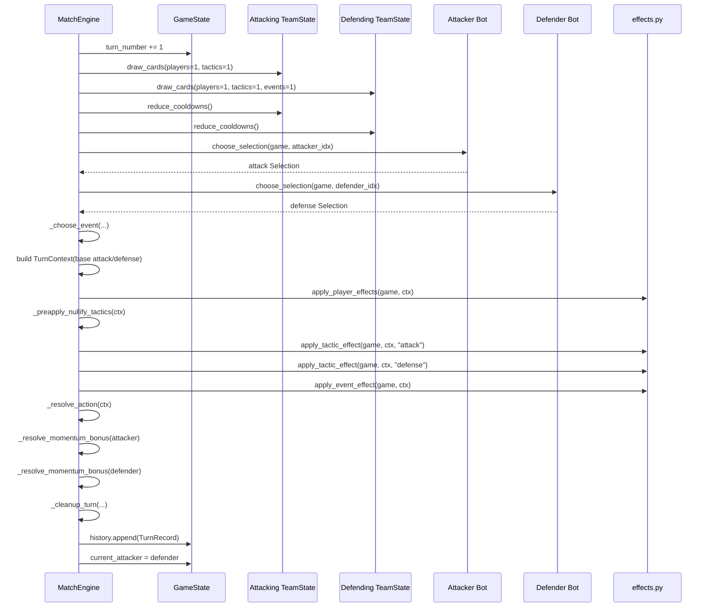

# Deckspector Architecture

This document explains how the simulator is structured and how the main entities interact, so you can safely modify behavior without first reverse-engineering the code.

## 1. Design Goals

- Keep game logic explicit and easy to trace.
- Represent cards mostly as data, and card behavior as named effect hooks.
- Keep match flow deterministic under a seed.
- Make simulation and balancing experiments easy to run.

The code is intentionally a custom rules engine for this game, not a generic card framework.

## 2. Module Map

- `dt_manager/models.py`
  - Domain types and mutable runtime state.
  - Defines cards, team state, turn context, history records, and bot adapter protocol.
- `dt_manager/catalog.py`
  - Static card catalog and starter deck builders.
  - Links each card to effect names (string keys).
- `dt_manager/effects.py`
  - Effect implementations and effect registries.
  - Applies player effects, tactic effects, and event effects into a `TurnContext`.
- `dt_manager/bots.py`
  - Decision policies for lineups, tactics, and event usage (`RandomBot`, `GreedyBot`).
- `dt_manager/rules.py`
  - Match orchestration (`MatchEngine`).
  - Executes turn lifecycle, resolution, cleanup, and victory checks.
- `dt_manager/simulate.py`
  - Multi-game simulation harness returning aggregate statistics.
- `dt_manager/__init__.py`
  - Convenience exports for package consumers.

## 3. Core Entities

### Card data objects

Cards are immutable dataclasses in `models.py`:

- `PlayerCard(name, attack, defense, positive_effect, negative_effect, tags, implemented)`
- `TacticCard(name, effect, implemented)`
- `EventCard(name, effect, implemented, meteorological)`

Key point: cards mostly carry identifiers. Actual behavior lives in `effects.py` and is looked up by these effect names.

### Team runtime state (`TeamState`)

Each team owns three deck systems (players, tactics, events), each with:

- draw pile
- hand
- discard pile

Plus extra runtime fields:

- `active_tactic`: currently persisted tactic in play
- `score`
- `momentum`
- `cooldowns`: player name -> turns remaining
- `play_counts`: player name -> times played (used by wear-like effects)

`TeamState` also encapsulates recurring mechanics:

- cooldown decrement/removal
- reshuffle when draw piles are empty
- drawing cards by type
- listing currently playable players (`available_players`)

### Match runtime (`GameState`)

`GameState` is the global mutable state:

- two `TeamState` objects
- shared RNG
- target goals
- current attacker index
- turn counter
- turn history

### Turn-scoped working state (`TurnContext`)

`TurnContext` is the central scratchpad for one turn. It carries:

- both selections (attack and defense)
- chosen event
- current attack/defense values
- many boolean flags and modifiers used by effects and resolution
- free-form notes for explainability/logging

Important: effects do not mutate `GameState` directly most of the time; they mainly mutate `TurnContext`, then `MatchEngine` resolves outcomes and applies persistent state changes.

### Bot interface (`BotAdapter`)

Bots are wrapped as:

- `choose_selection(game, team_idx) -> Selection`
- `choose_event(game, team_idx) -> Optional[EventCard]`

This keeps strategy pluggable without changing engine internals.

## 4. Control Flow: From Match Start to Match End

## Engine creation (`MatchEngine.create`)

1. Validate all cards in each deck have `implemented=True`.
2. Build `TeamState` objects from provided decks.
3. Shuffle all draw piles with seeded RNG.
4. Initial draw for both teams: 5 players, 3 tactics, 1 event.
5. Initialize `GameState` with team 0 as first attacker.

If a deck contains not implemented cards, creation fails early with `ValueError`.

## Match loop (`MatchEngine.run`)

Each iteration:

1. Check victory (`score >= target_goals`).
2. If not ended, play exactly one turn (`play_turn`).
3. Stop at `max_turns` and choose winner by higher/equal score fallback.

## Turn lifecycle (`MatchEngine.play_turn`)

Turn execution order is critical:

1. Increment turn number.
2. Determine attacker and defender from `current_attacker`.
3. Reduce cooldowns for both teams.
4. Draw phase:
   - attacker draws 1 player + 1 tactic
   - defender draws 1 player + 1 tactic + 1 event
5. Ask both bots for `Selection`.
6. Determine whether an event is playable (`_choose_event`).
7. Build `TurnContext` with base attack/defense sums.
8. Apply effects in this exact order:
   - player effects
   - pre-nullify tactics for "Polemica continua"
   - attack tactic effect
   - defense tactic effect
   - event effect
9. Resolve action (`_resolve_action`): compare attack vs defense, then possible goal attempt(s).
10. Resolve momentum bonus for each team (`_resolve_momentum_bonus`).
11. Cleanup selected cards and event usage (`_cleanup_turn`).
12. Persist a `TurnRecord` into history.
13. Swap attacker for next turn.

If you change behavior, check whether it belongs before or after a specific phase above.

## 5. Interaction Between Systems

### Catalog -> Effects

`catalog.py` defines each card and assigns effect keys such as `"dave_wear"` or `"pressing_alto"`.
`effects.py` maps those keys to concrete functions in:

- `PLAYER_EFFECTS`
- `TACTIC_EFFECTS`
- `EVENT_EFFECTS`

If the key is missing in a registry, that effect is silently not applied.

### Bots -> Engine

Bots only choose:

- player lineup (normally two players, unless limited by cooldown/hand)
- tactic to use or keep active
- event choice when the engine allows an event

Bots do not resolve outcomes; they only provide decisions.

### Engine -> Effects -> Context

Effect functions receive `(game, ctx, side)` or `(game, ctx)` and typically:

- adjust `ctx.attack_value` / `ctx.defense_value`
- set turn flags (tie rules, event ignore, exact-six rule, nullify flags, etc.)
- append notes for explainability

After this, the engine performs deterministic resolution using the updated context.

### Resolution -> Persistent state

Persistent changes are applied by engine methods:

- score and momentum updates
- cooldown and play counts
- moving selected cards between hand/discard/active slots
- consuming played event cards
- appending turn history

## 6. Event Eligibility and Special Cases

Event play is controlled by `_choose_event`:

- If one team is behind, only the behind team may play an event.
- If scores are tied, event play is normally blocked.
- Tie exception: if a selected lineup includes `Ernesto`, that side can become event candidate.
- If candidate team has no event cards in hand, no event is played.

This means event availability is a mix of score state and selected players, not just hand contents.

## 7. Data Mutation Boundaries

Use this rule of thumb when adding features:

- Put temporary per-turn modifiers in `TurnContext`.
- Put long-lived match state in `TeamState` / `GameState`.

Typical examples:

- "+2 attack this turn" -> `TurnContext`
- "player exhausted for next two turns" -> `TeamState.cooldowns`
- "team gained a goal" -> `TeamState.score`

Keeping this separation makes effects easier to reason about and prevents accidental persistent side effects.

## 8. Extension Guide

## Add a new card with behavior

1. Add card data in `catalog.py` with a unique effect key string.
2. Implement effect function in `effects.py`.
3. Register the function in the appropriate effect dictionary.
4. If needed, add new fields to `TurnContext` for temporary flags/modifiers.
5. Add or update tests in `tests/`.

## Add a new bot

1. Implement class with `choose_selection` and `choose_event`.
2. Expose adapter constructor returning `BotAdapter`.
3. Plug it into `MatchEngine.create(...)` callers.

## Add a new persistent mechanic

1. Add state field to `TeamState` or `GameState`.
2. Update turn lifecycle in `rules.py` where that mechanic should trigger.
3. Log notes when useful for debugging and analysis.

## 9. Existing Invariants and Assumptions

- Engine only accepts decks with implemented cards.
- Teams can play fewer than two players if availability is constrained.
- Tactic persistence is handled via `active_tactic` and `keep_active_tactic`.
- Event cards are consumed only if actually selected and present in hand.
- Turn history length should match turns played.

These assumptions are good places to add regression tests when refactoring.

## 10. Practical Entry Points for New Contributors

- Start by reading `models.py` and `rules.py` to understand data + lifecycle.
- Then inspect `effects.py` to see concrete rule interactions.
- Use `examples/run_quickstart.py` for a quick executable walkthrough.
- Use `simulate.py` to validate balance-impact changes over many games.

If you are unsure where to put logic, prefer adding it as an effect first and only alter engine flow when the mechanic truly changes phase order or persistent state transitions.

## 11. Turn Sequence Diagram

The diagram below represents one call to `MatchEngine.play_turn`.

Plain-text fallback (same order):

1. Increment turn counter and identify attacker/defender.
2. Reduce cooldowns, then draw new cards for both sides.
3. Ask both bots for lineup/tactic decisions.
4. Determine if an event can be played and by whom.
5. Build `TurnContext` from base lineup attack/defense values.
6. Apply effects in order: players -> tactic nullification pre-pass -> attack tactic -> defense tactic -> event.
7. Resolve duel and possible shot(s), then momentum bonuses.
8. Move played cards to cooldown/discard/active slots as needed.
9. Record turn history and hand over attack to the other team.